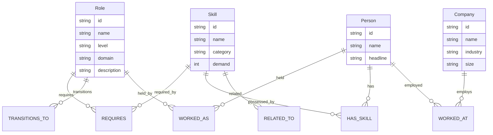
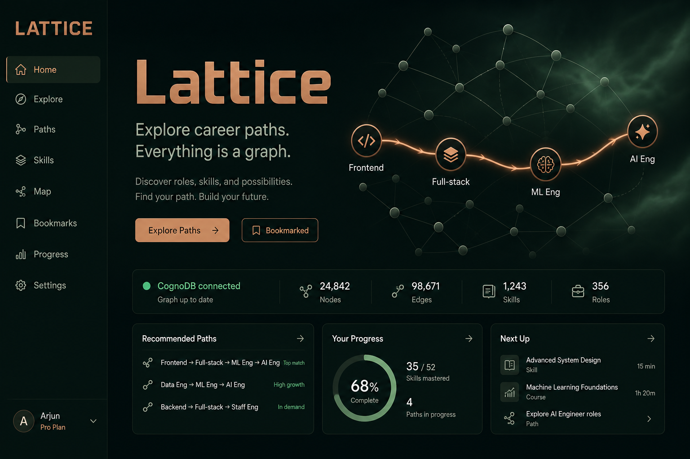
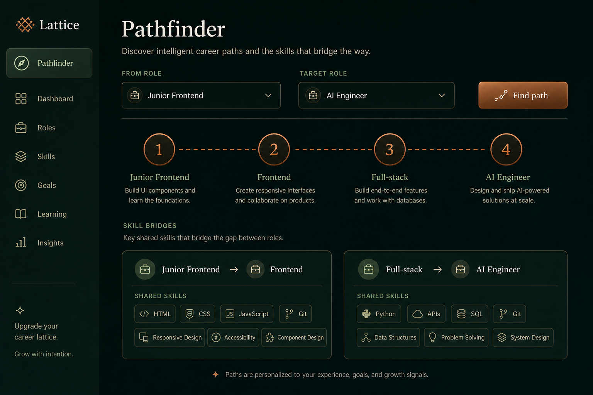

# Lattice

**Career paths on a graph.** Lattice is a small web app backed by [CognoDB](https://cognodb.com) that helps you explore how roles connect through skills, transitions, and people.

> Careers are not ladders — they are networks. Lattice makes those networks traversable.

**Stack:** Next.js (App Router) · TypeScript · official `neo4j-driver` · CognoDB (Bolt + openCypher)

---

## Why a graph database?

Career mobility questions are about *connections*, not rows:

| Question | Graph | Relational |
| --- | --- | --- |
| Shortest path from Frontend → AI Engineer (≤6 hops) | `shortestPath` on `TRANSITIONS_TO` | Recursive CTE + hop reconstruction |
| Which roles bridge two careers via shared skills? | 2-hop pattern over `REQUIRES` | Repeated self-joins + set intersection |
| Neighborhood of a role (skills, people, related roles) | Fan-out from one node | Join-table gymnastics that grow with every new edge type |

A graph keeps the domain language intact: roles *require* skills, people *worked as* roles, skills *relate to* skills. That model is the product — not an afterthought bolted onto tables.

---

## Data model



### Node labels

- **Role** — job titles across Engineering, Data, Product, Design, Leadership
- **Skill** — capabilities with category + demand score
- **Person** — sample professionals with career histories
- **Company** — employers in the seed graph

### Relationship types

| Type | From → To | Properties |
| --- | --- | --- |
| `REQUIRES` | Role → Skill | `importance` (`core` / `strong` / `helpful`) |
| `TRANSITIONS_TO` | Role → Role | `frequency`, `difficulty` |
| `RELATED_TO` | Skill → Skill | `strength` |
| `WORKED_AS` | Person → Role | `years`, `order` |
| `HAS_SKILL` | Person → Skill | — |
| `WORKED_AT` | Person → Company | — |

ASCII sketch:

```
  (Person)-[:WORKED_AT]->(Company)
      |
      +--[:WORKED_AS]->(Role)-[:TRANSITIONS_TO]->(Role)
      |                  |
      +--[:HAS_SKILL]->(Skill)<-[:REQUIRES]-(Role)
                           |
                     [:RELATED_TO]
```

---

## Features

1. **Pathfinder** — multi-hop `shortestPath` between any two roles, with transition hints and shared skills per hop
2. **Skill bridges** — intermediate roles connected through overlapping skill requirements (graph-native query that is awkward in SQL)
3. **Role explorer** — skills, related roles, and people in a role’s neighborhood
4. **Graceful DB errors** — clear banner when CognoDB is unreachable or credentials are missing

---

## Setup: CognoDB Cloud

1. Sign up at [console.cognodb.com/signup](https://console.cognodb.com/signup) (free tier, no credit card).
2. Create a free **c0** instance and pick a region.
3. Copy the connection URI (`bolt+s://<id>.databases.cognodb.cloud`) and the password for user `cognodb` (**shown once**).
4. Keep the instance running until Wexa finishes reviewing.

---

## Run locally

```bash
# 1. Install
npm install

# 2. Configure secrets (never commit real values)
cp .env.example .env.local
# Edit .env.local:
#   COGNODB_URI=bolt+s://....databases.cognodb.cloud
#   COGNODB_USER=cognodb
#   COGNODB_PASSWORD=...

# 3. Load seed data (idempotent — clears then MERGEs)
npm run seed

# 4. Start the app
npm run dev
```

Open [http://localhost:3000](http://localhost:3000).

### Environment variables

| Variable | Required | Description |
| --- | --- | --- |
| `COGNODB_URI` | yes | Bolt URI from CognoDB console |
| `COGNODB_PASSWORD` | yes | Password shown at provisioning |
| `COGNODB_USER` | no | Defaults to `cognodb` |

---

## Main queries

All queries live in [`src/lib/queries.ts`](src/lib/queries.ts) and are executed with **parameterised** `session.run(cypher, params)` — no string concatenation. Reference copies are in [`docs/queries.cypher`](docs/queries.cypher).

### 1. Multi-hop career path

```cypher
MATCH (from:Role {id: $fromId}), (to:Role {id: $toId})
MATCH path = shortestPath((from)-[:TRANSITIONS_TO*1..6]->(to))
RETURN nodes(path), relationships(path), length(path)
```

### 2. Skill bridges (awkward for relational DBs)

```cypher
MATCH (from:Role {id: $fromId})-[:REQUIRES]->(s1:Skill)<-[:REQUIRES]-(mid:Role)
WHERE mid.id <> $fromId AND mid.id <> $toId
WITH mid, collect(DISTINCT s1.name) AS sharedWithFrom
MATCH (mid)-[:REQUIRES]->(s2:Skill)<-[:REQUIRES]-(to:Role {id: $toId})
RETURN mid, sharedWithFrom, collect(DISTINCT s2.name) AS sharedWithTo
ORDER BY size(sharedWithFrom) + size(sharedWithTo) DESC
```

This walks **Role → Skill → Role → Skill → Role**. Expressing ranked set intersections over a variable mid-role is verbose and brittle with SQL join tables.

### 3. Role neighborhood

```cypher
MATCH (r:Role {id: $roleId})-[:REQUIRES]->(s:Skill)<-[:REQUIRES]-(other:Role)
WHERE other.id <> $roleId
RETURN other, collect(DISTINCT s.name) AS sharedSkills
ORDER BY size(sharedSkills) DESC
```

---

## Project structure

```
src/
  app/                 # Next.js App Router pages + API routes
  components/          # UI (pathfinder, explorer, status)
  lib/                 # neo4j driver, queries, types
scripts/
  data.ts              # Realistic seed dataset
  seed.ts              # Idempotent loader
docs/
  queries.cypher       # Query reference
```

---

## Screenshots





> Replace these with live captures from your seeded instance before submitting if you prefer real browser screenshots.

---

## Hosted demo

- **Live app:** _add Vercel / Railway URL after deploy_
- **Screen recording:** _add Loom / Drive link_

### Deploy (Vercel)

1. Push this repo to GitHub.
2. Import the project in Vercel.
3. Set `COGNODB_URI`, `COGNODB_USER`, `COGNODB_PASSWORD` in project env vars.
4. Deploy. Run `npm run seed` once from your machine (or a one-off CI job) against the same instance.

---

## Submit checklist (Wexa)

- [x] CognoDB-backed graph app with thoughtful model
- [x] Seed script + realistic data
- [x] Multi-hop + SQL-awkward Cypher (parameterised)
- [x] Web UI with loading / empty / error states
- [x] Secrets via env vars
- [ ] Hosted demo URL
- [ ] Short screen recording
- [ ] Email `hr@wexa.ai` — subject: `CognoDB Assignment 2 – <Your Name>`

Keep the CognoDB instance running until you hear back.
